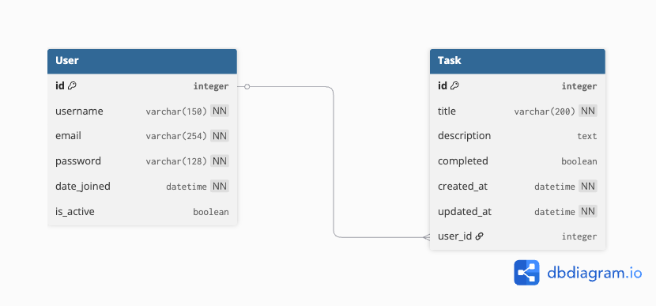
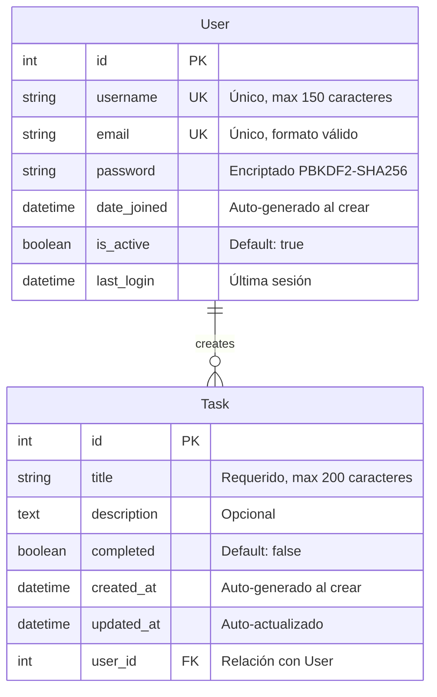

# Documento de Diseño - Task Management API

## 1. Requerimientos Funcionales

### 1.1 Autenticación y Autorización

**RF-01: Registro de Usuarios**
- **Descripción**: El sistema debe permitir el registro de nuevos usuarios proporcionando username, email y password
- **Entrada**: Username (3-150 caracteres), email válido, password (mínimo 8 caracteres)
- **Validaciones**: 
  - Username único en el sistema
  - Email único y con formato válido
  - Password debe cumplir políticas de seguridad (mínimo 8 caracteres, al menos una letra y un número)
- **Salida**: Tokens JWT (access y refresh) y datos del usuario creado
- **Criterio de Aceptación**: Usuario puede registrarse exitosamente y recibir tokens para acceder al sistema

**RF-02: Inicio de Sesión (Login)**
- **Descripción**: Usuarios registrados deben poder autenticarse con sus credenciales
- **Entrada**: Username y password
- **Proceso**: Validación de credenciales contra base de datos
- **Salida**: Tokens JWT (access y refresh) y datos del usuario
- **Manejo de Errores**: Mensaje de error genérico para credenciales inválidas (prevenir enumeración de usuarios)
- **Criterio de Aceptación**: Usuario autenticado recibe tokens válidos con tiempo de expiración de 1 hora

**RF-03: Protección de Endpoints**
- **Descripción**: Todos los endpoints de gestión de tareas deben requerir autenticación
- **Mecanismo**: Bearer Token en header Authorization
- **Validación**: Verificación de firma JWT y expiración
- **Respuesta sin token**: HTTP 401 Unauthorized
- **Criterio de Aceptación**: Requests sin token válido son rechazados automáticamente

**RF-04: Cierre de Sesión (Logout)**
- **Descripción**: Usuario puede cerrar sesión de forma segura
- **Implementación**: Limpieza de tokens en cliente (localStorage)
- **Nota**: Implementación stateless, token sigue siendo válido hasta expiración
- **Criterio de Aceptación**: Cliente elimina tokens y redirige a página de login

### 1.2 Gestión de Tareas (CRUD Completo)

**RF-05: Crear Tarea**
- **Descripción**: Usuario autenticado puede crear nuevas tareas
- **Entrada**: 
  - Title (requerido, max 200 caracteres)
  - Description (opcional, texto largo)
  - Completed (opcional, default: false)
- **Proceso**: Tarea se asocia automáticamente al usuario autenticado (user_id extraído del token JWT)
- **Salida**: Objeto Task creado con todos sus campos incluyendo timestamps
- **Criterio de Aceptación**: Tarea creada aparece inmediatamente en el listado del usuario

**RF-06: Listar Tareas**
- **Descripción**: Usuario puede ver todas sus tareas ordenadas por fecha de creación
- **Filtrado**: Automático por user_id (aislamiento de datos)
- **Ordenamiento**: Por created_at descendente (más recientes primero)
- **Salida**: Array de objetos Task con todos sus campos
- **Criterio de Aceptación**: Usuario solo ve sus propias tareas, nunca las de otros usuarios

**RF-07: Actualizar Tarea**
- **Descripción**: Usuario puede modificar sus tareas existentes
- **Métodos Soportados**:
  - PUT: Actualización completa (requiere todos los campos)
  - PATCH: Actualización parcial (solo campos enviados)
- **Validación**: Solo el propietario puede actualizar la tarea
- **Proceso**: Campo updated_at se actualiza automáticamente
- **Criterio de Aceptación**: Cambios se reflejan inmediatamente y otros usuarios no pueden modificar tareas ajenas

**RF-08: Marcar Tarea como Completada/Pendiente**
- **Descripción**: Toggle del estado de completitud de una tarea
- **Implementación**: Actualización del campo booleano "completed"
- **UI Esperada**: Checkbox o botón de toggle en frontend
- **Criterio de Aceptación**: Estado se actualiza instantáneamente

**RF-09: Eliminar Tarea**
- **Descripción**: Usuario puede eliminar permanentemente sus tareas
- **Validación**: Solo el propietario puede eliminar
- **Tipo**: Hard delete (eliminación física de la base de datos)
- **Respuesta**: HTTP 204 No Content
- **Criterio de Aceptación**: Tarea desaparece del listado y no puede ser recuperada

**RF-10: Aislamiento de Datos por Usuario**
- **Descripción**: Sistema debe garantizar que cada usuario solo acceda a sus propios datos
- **Implementación**: 
  - Filtrado a nivel de QuerySet en ViewSet
  - Validación de permisos antes de cualquier operación
- **Seguridad**: Intentos de acceso a tareas ajenas devuelven HTTP 404 (no 403 para evitar información)
- **Criterio de Aceptación**: Tests de seguridad confirman aislamiento completo entre usuarios

## 2. Requerimientos No Funcionales

### 2.1 Seguridad

**RNF-01: Autenticación JWT Stateless**
- **Descripción**: Sistema utiliza JSON Web Tokens para autenticación sin estado de sesión
- **Especificaciones**:
  - Algoritmo: HS256 (HMAC-SHA256)
  - Access Token Lifetime: 1 hora
  - Refresh Token Lifetime: 7 días
  - Firma con SECRET_KEY rotada en producción
- **Ventajas**: Escalabilidad horizontal sin necesidad de almacenamiento de sesiones
- **Medición**: 100% de requests autenticados utilizan JWT válido

**RNF-02: Cifrado de Contraseñas**
- **Descripción**: Contraseñas nunca se almacenan en texto plano
- **Algoritmo**: PBKDF2-SHA256 con iteraciones configurables
- **Salt**: Único por usuario, generado automáticamente
- **Medición**: Auditoría de base de datos confirma 0 passwords en texto plano

**RNF-03: Validación de Entrada**
- **Descripción**: Toda entrada de usuario debe ser validada y sanitizada
- **Implementación**: Serializers de DRF con validadores integrados
- **Protección contra**: SQL Injection, XSS, CSRF
- **Medición**: Logs sin intentos exitosos de inyección

**RNF-04: CORS Configurado Explícitamente**
- **Descripción**: Control estricto de orígenes permitidos
- **Configuración**:
  - Desarrollo: localhost:5173, localhost:3000
  - Producción: entrevista-tecnica.netlify.app
- **Headers Permitidos**: Authorization, Content-Type, Accept
- **Métodos Permitidos**: GET, POST, PUT, PATCH, DELETE, OPTIONS
- **Medición**: Requests de orígenes no autorizados son bloqueados

### 2.2 Performance y Escalabilidad

**RNF-05: Tiempo de Respuesta**
- **Descripción**: API debe responder en tiempos aceptables para buena UX
- **Objetivos**:
  - Endpoints de lectura (GET): < 100ms
  - Endpoints de escritura (POST/PUT/PATCH): < 200ms
  - Autenticación (login/register): < 300ms
- **Medición**: Monitoreo de Render con métricas de latencia
- **Optimizaciones**: Uso de índices en base de datos, queries optimizadas

**RNF-06: Escalabilidad Horizontal**
- **Descripción**: Sistema debe soportar múltiples instancias concurrentes
- **Implementación**: Stateless architecture con JWT
- **Base de Datos**: PostgreSQL con connection pooling (Neon.tech)
- **Medición**: Capacidad de escalar instancias sin pérdida de funcionalidad

**RNF-07: Optimización de Queries**
- **Descripción**: Minimizar queries a base de datos
- **Técnicas**:
  - Uso de select_related y prefetch_related cuando sea necesario
  - Índices en campos frecuentemente consultados (user_id, created_at)
  - Paginación para listados grandes (preparado para futuro)
- **Medición**: Django Debug Toolbar en desarrollo muestra número de queries

### 2.3 Disponibilidad y Confiabilidad

**RNF-08: Uptime del Sistema**
- **Descripción**: Sistema debe estar disponible 99% del tiempo
- **Deployment**: Render con health checks automáticos
- **Base de Datos**: Neon.tech con backups automáticos
- **Medición**: Monitoreo de uptime en Render dashboard

**RNF-09: Manejo de Errores**
- **Descripción**: Sistema debe manejar errores de forma predecible y segura
- **HTTP Status Codes Apropiados**:
  - 200 OK: Operación exitosa
  - 201 Created: Recurso creado exitosamente
  - 204 No Content: Eliminación exitosa
  - 400 Bad Request: Error de validación
  - 401 Unauthorized: Falta autenticación
  - 404 Not Found: Recurso no existe o sin permisos
  - 500 Internal Server Error: Error del servidor
- **Mensajes de Error**: JSON estructurado con detalles útiles
- **Logging**: Errores 500 se registran para debugging

**RNF-10: Testing y Cobertura**
- **Descripción**: Código debe tener cobertura de tests adecuada
- **Implementación**: 31 tests unitarios implementados
- **Áreas Cubiertas**:
  - Modelos (5 tests)
  - Serializers (6 tests)
  - Endpoints API (14 tests)
  - Autenticación (8 tests)
- **Ejecución**: Tests con SQLite en memoria para velocidad
- **Medición**: 100% de tests pasando antes de cada deploy

### 2.4 Mantenibilidad y Calidad de Código

**RNF-11: Estructura de Código**
- **Descripción**: Código debe seguir mejores prácticas de Django/DRF
- **Organización**: Apps separadas por dominio (tasks, users)
- **Estilo**: PEP 8 compliance
- **Documentación**: Docstrings en funciones y clases importantes

**RNF-12: Variables de Entorno**
- **Descripción**: Configuración sensible separada del código
- **Implementación**: python-dotenv con archivo .env
- **Seguridad**: .env no se commitea a Git (.gitignore)
- **Template**: .env.example incluido para referencia

## 3. Supuestos y Decisiones

### Tecnológicos
- Django 5.0 por su estabilidad y madurez
- DRF para API RESTful con serializers automáticos
- PostgreSQL sobre SQLite para ambiente productivo desde el inicio
- JWT simple (sin refresh token rotation) para simplificar MVP
- Neon.tech como provider de DB por su tier gratuito y pooling

### Funcionales
- Una tarea pertenece a un solo usuario (no hay colaboración)
- No hay roles (todos los usuarios tienen los mismos permisos)
- Las tareas eliminadas no se guardan (no hay soft delete)
- Email se requiere en registro pero no se valida vía correo
- Timestamps (created_at, updated_at) se manejan automáticamente

### Arquitectura
- Separación total frontend/backend (SPA + API)
- Stateless authentication (solo JWT, sin sesiones)
- CORS explícito (no `CORS_ORIGIN_ALLOW_ALL`)

## 4. Diagrama de Entidades y Relaciones (ERD)

### Diagrama Visual ERD



*Figura 1: Diagrama de entidades mostrando la relación 1:N entre User y Task*

### Diagrama de Arquitectura del Sistema

.png)

*Figura 2: Arquitectura de 3 capas - Frontend (Vue), Backend (Django), Database (PostgreSQL)*

### Diagrama Mermaid (Alternativo)



### Descripción de Entidades

#### **User (Usuario)**

**Campos:**
- `id` (PK): Identificador único autoincrementable
- `username` (UNIQUE): Nombre de usuario único (3-150 caracteres)
- `email` (UNIQUE): Correo electrónico único con validación de formato
- `password`: Contraseña hasheada con PBKDF2-SHA256 (nunca se almacena en texto plano)
- `date_joined`: Fecha y hora de registro del usuario
- `is_active`: Indica si la cuenta está activa (para soft delete de usuarios)
- `last_login`: Última fecha de inicio de sesión

**Restricciones:**
- Username no puede contener espacios
- Email debe tener formato válido (validación Django)
- Password debe cumplir con validadores de Django (mínimo 8 caracteres)

#### **Task (Tarea)**

**Campos:**
- `id` (PK): Identificador único autoincrementable
- `title`: Título descriptivo de la tarea (requerido, max 200 caracteres)
- `description`: Descripción detallada de la tarea (opcional, campo de texto largo)
- `completed`: Estado de completitud de la tarea (booleano, default: false)
- `created_at`: Timestamp de creación (auto-generado, no editable)
- `updated_at`: Timestamp de última modificación (auto-actualizado)
- `user_id` (FK): Clave foránea que referencia al usuario propietario

**Restricciones:**
- Title no puede estar vacío
- Una tarea debe tener siempre un usuario asignado

### Relaciones

**User → Task (1:N)**
- Un usuario puede crear **múltiples tareas** (relación uno a muchos)
- Cada tarea pertenece a **un único usuario** (clave foránea obligatoria)
- **Política de eliminación**: `CASCADE` - Al eliminar un usuario se eliminan todas sus tareas
- **Política de seguridad**: Cada usuario solo puede ver, editar y eliminar sus propias tareas

### Índices y Optimizaciones

- `User.username` - Índice único (búsquedas rápidas en login)
- `User.email` - Índice único (validación de duplicados en registro)
- `Task.user_id` - Índice (filtrado rápido de tareas por usuario)
- `Task.created_at` - Índice (ordenamiento por fecha de creación)
- `Task.completed` - Índice parcial (filtrado por estado)

### Reglas de Negocio a Nivel de Base de Datos

1. **Integridad Referencial**: No pueden existir tareas huérfanas (sin usuario)
2. **Eliminación en Cascada**: Al borrar un usuario se borran sus tareas automáticamente
3. **Unicidad**: No pueden existir dos usuarios con el mismo username o email
4. **Timestamps Automáticos**: created_at y updated_at se gestionan automáticamente por Django

### Representación Textual (Formato Alternativo)

#### User (Django default con extensión)
```
User
├── id (PK)
├── username (unique)
├── email (unique)
├── password (hashed)
├── date_joined
└── last_login
```

#### Task
```
Task
├── id (PK)
├── user_id (FK → User) [CASCADE]
├── title (CharField, max 200)
├── description (TextField, nullable)
├── completed (Boolean, default=False)
├── created_at (auto_now_add)
└── updated_at (auto_now)
```

**Relación**: `User 1:N Task`  
**Restricción**: Al eliminar usuario se eliminan sus tareas (CASCADE)

## 5. Endpoints Implementados

| Método | Ruta | Descripción | Auth |
|--------|------|-------------|------|
| POST | `/api/auth/register/` | Registro de nuevo usuario | No |
| POST | `/api/auth/login/` | Login y obtención de tokens | No |
| GET | `/api/tasks/` | Listar tareas del usuario | Sí |
| POST | `/api/tasks/` | Crear nueva tarea | Sí |
| GET | `/api/tasks/{id}/` | Detalle de una tarea | Sí |
| PUT | `/api/tasks/{id}/` | Actualización completa | Sí |
| PATCH | `/api/tasks/{id}/` | Actualización parcial | Sí |
| DELETE | `/api/tasks/{id}/` | Eliminar tarea | Sí |

**Base URL Producción**: `https://backend-python-django-crud-auth.onrender.com/api/`

## 6. Autenticación y Seguridad

### Flow JWT
1. Usuario hace login → recibe `access_token` y `refresh_token`
2. Frontend almacena tokens en localStorage
3. Cada request incluye header: `Authorization: Bearer {access_token}`
4. Token expira en 1 hora → frontend maneja 401 y redirige a login

### Configuración CORS
- Permite orígenes específicos (no wildcard)
- Acepta credenciales (`CORS_ALLOW_CREDENTIALS = True`)
- Headers permitidos: Authorization, Content-Type, etc.
- Métodos: GET, POST, PUT, PATCH, DELETE, OPTIONS

## 7. Validaciones

### Registro
- Username: requerido, único, 3-150 caracteres
- Email: requerido, único, formato válido
- Password: mínimo 8 caracteres (Django validators)

### Tareas
- Title: requerido, max 200 caracteres
- Description: opcional
- Completed: boolean, default false
- User: asignado automáticamente desde token

## 8. Estructura de Respuestas

### Éxito - Login (200)
```json
{
  "access": "eyJ0eXAiOiJKV1QiLCJ...",
  "refresh": "eyJ0eXAiOiJKV1QiLCJ...",
  "user": {
    "id": 1,
    "username": "usuario",
    "email": "email@example.com"
  }
}
```

### Éxito - Lista Tareas (200)
```json
[
  {
    "id": 1,
    "title": "Tarea ejemplo",
    "description": "Descripción",
    "completed": false,
    "created_at": "2024-01-15T10:30:00Z",
    "updated_at": "2024-01-15T10:30:00Z"
  }
]
```

### Error - Validación (400)
```json
{
  "email": ["Este campo es obligatorio."],
  "password": ["Este campo es obligatorio."]
}
```

### Error - No Autorizado (401)
```json
{
  "detail": "Authentication credentials were not provided."
}
```

## 9. Consideraciones de Deployment

### Render
- Build command: `./build.sh`
- Start command: `gunicorn config.wsgi:application`
- Auto-deploy habilitado en branch `fix`
- Health check endpoint: `/api/tasks/` (requiere auth)

### Base de Datos
- Neon PostgreSQL pooling (serverless)
- SSL requerido (`sslmode=require`)
- Conexiones manejadas por pool (max 10 en tier gratuito)

### Variables Críticas
- `DEBUG=False` en producción
- `SECRET_KEY` única por ambiente
- `ALLOWED_HOSTS` específico por dominio
- `CORS_ALLOWED_ORIGINS` separado por comas

